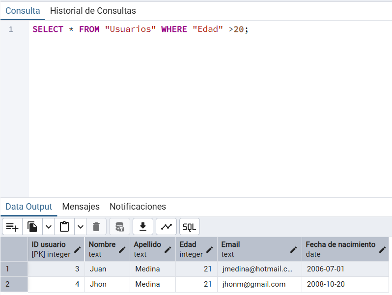
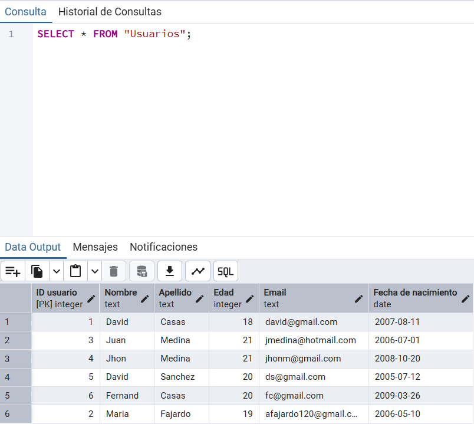

# WHERE

Esta sentencia permite actuar como un filtro a la hora de relizar distintas consultas, todo esto en base a alguna condición que el usuriao puede especificar teniendo en cunata las columnas de las tabla en la que se realiza la consulta, su sintaxis general es: 

```SQL
SELECT "Column1" FROM "nameTab" WHERE "someColumn" = "someValue";
```
En este caso someColumn hace referencia a cualquier columna de la tabla de la cual se extrae la consulta y someValue hace referencia a cualquier valor para comparar, cabe aclarar que se puede usar más operadores logicos como el menor que (<) o el mayor que (>).

Acontinuación un ejemplo practico de como se puede usar esta sentencia: 



En esta se puede apreciar como la consulta solo muestra los registros que presentan una edad mayor a uno del registro original: 

