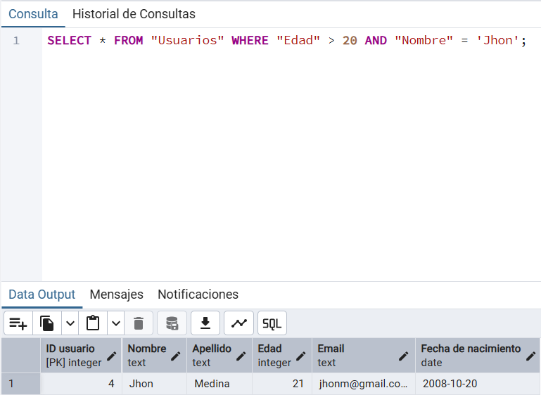
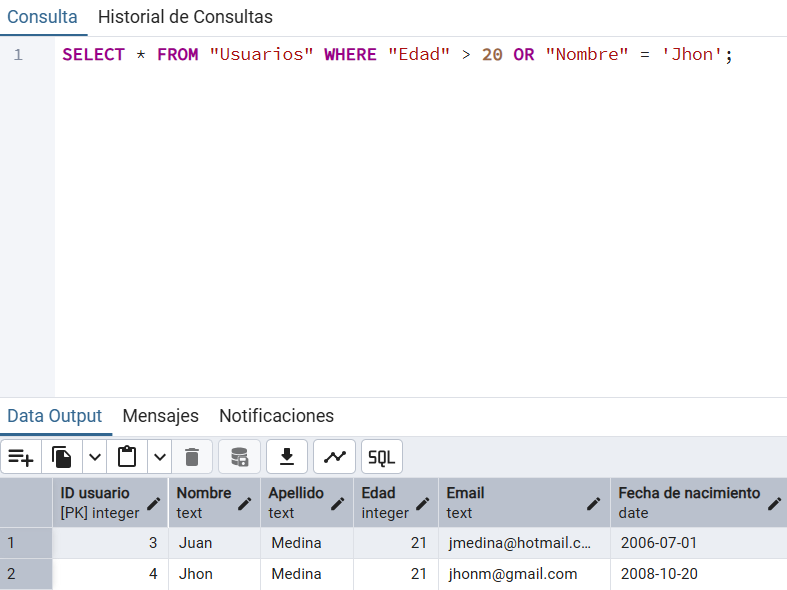
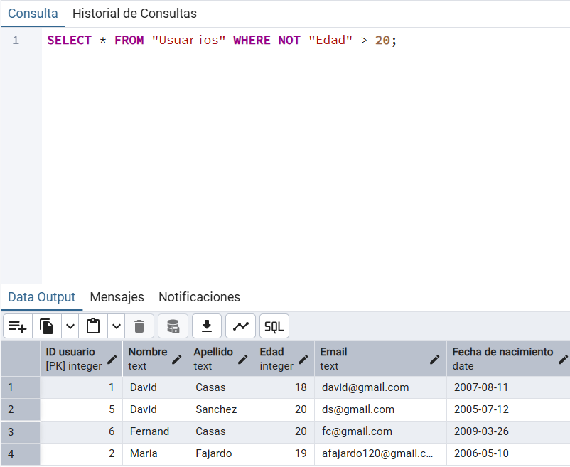
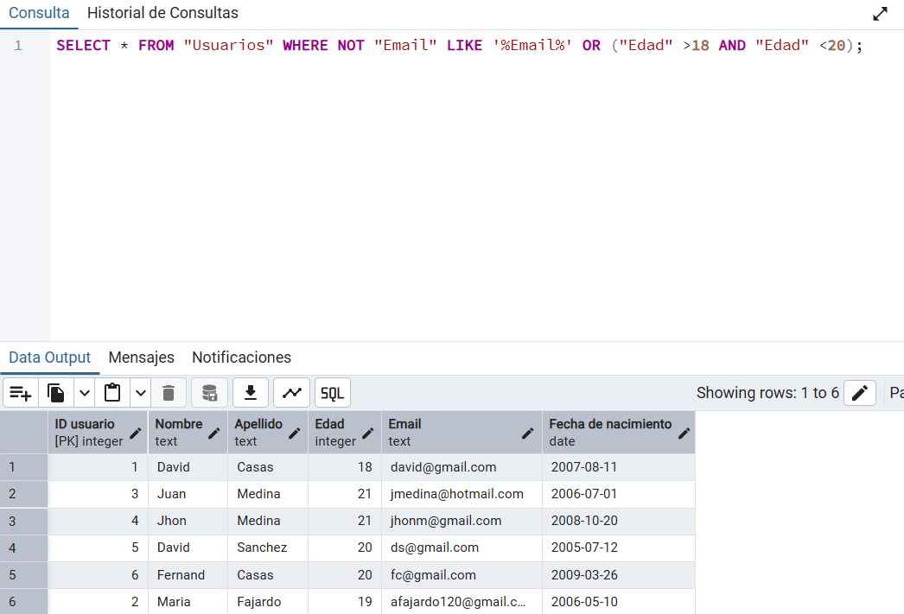

# AND, OR y NOT

-Sintaxis basica: 

**AND:** La sentencia AND se usa justo despues de declarar un WHERE con el fin de añadir más condiciones de fltrado a la busqueda, su sintaxis basica es: 

```SQL
SELECT "columna1" FROM "nameTab" WHERE "columnA" = 'valorA' AND "columnB" = 'valorB';
```

Al igual que como ocurren con las expresiones boolenas en otros lenguajes de programación, a la hora de declarar un AND en un consulta, solo se mostraron los resultados que cumplan con las dos condiciones establecidas, por ejemplo:



**OR:** La sentenca booleana OR, se usa para añadir más condiciones al filtro WHERE en una consulta de SQL, solo que ahora las condiciones seran opcionales, su sentencia basica es: 

```SQL
SELECT "columna1" FROM "nameTab" WHERE "columnA" = 'valorA' OR "columnB" = 'valorB';
```
Esta sentencia se comporta de manera similar a las expresiones boolenas en los demás lenguajes de progrmación, ahora en el caso de las consultas de SQL se mostraran como resultados de las consultas aquellas que cumplan con alguna de las condiciones platenadas en el OR. 




**NOT:** La clusula NOT se usa para negar una condicion en una consulta SQL, similar a como se niega en una consicion boolena en otros lenguajes, sun sintaxis basica es:

```SQL
SELECT "columna1" FROM "nameTab" WHERE NOT "columnA" = 'valorA';
```



La senticia NOT puede compañarse junto con la CLAUSULA LIKE, AND y OR junto con el uso de parentesis para crear condiciones mas complejas, por ejemplo:



**NOTA IMPORTANTE:** En SQL, existe la gerarquia de operacodres booleanas debido a esto AND se evalua primero que OR, para evitar errores por este tipo de jerarquia se recomienda usar parentesis, como se uso en el ejemplo anteriror. 

