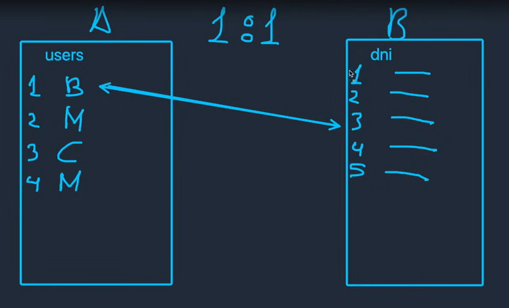

En este tipo de relacion se pueden tener 2 o más tablas, en donde un solo elemento de la tabla 1 puede tener relacion con un UNICO
elemento de la tabla 2.

Algo a tener en cuanta es que esta debe ser en ambos sentidos, es decir si el elemento A de la tabla 1 tiene relacion con el elemento
C de la tabla 2, entonces el elemento C solo podra tener relacion en la tabla si es con el elemento A. 

Para todas la realciones se necesitara implementar el uso de una clave primaria (PRIMARY KEY) y el uso de una clave foranea (FOREING KEY) la cual es una clave que pertene a una tabla agena a la que en se declara. 
