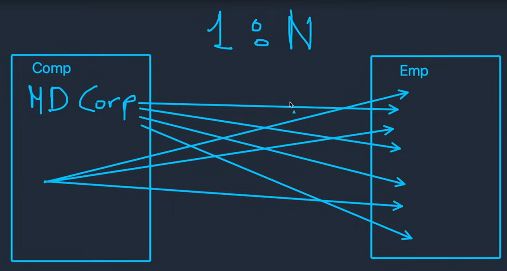

Este tipo de realcion tambien puede ser llamada 1 a muchos, en donde un elemento A la tabla 1 puede tener relacion con multiples elementos de la tabla 2, pero un elemento de la tabla 2 solo puede tener relación con un elemnto de la tabla 1; es decir que los elementos de la tabla 1 no pueden tener las mismas relaciones con la tabla 2. 

