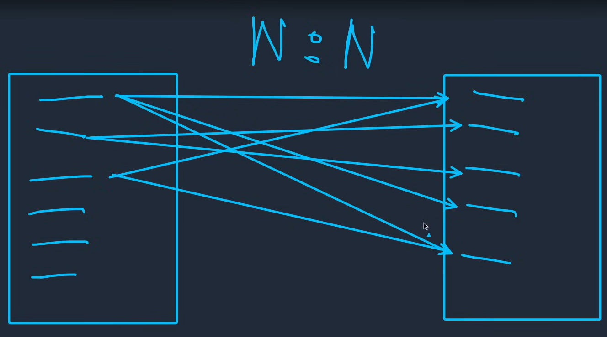

Esta relación permite que varios elementos de la tabla 1 se puedan relacionar con varios elementos de la tabla 2, al contrio a lo que ocurria con 1:N, en donde los elemenstos en la tabla 2 solo podia relacionarse con un unico elemento de la tabla 2, aqui los elementos de la tabla 2 si puedan tener más de una realcion con los elementos de la tabla 1, haciendo asi que los elementos de la tabla 1 puedar "repetir" elementos de la tabla 2. 

