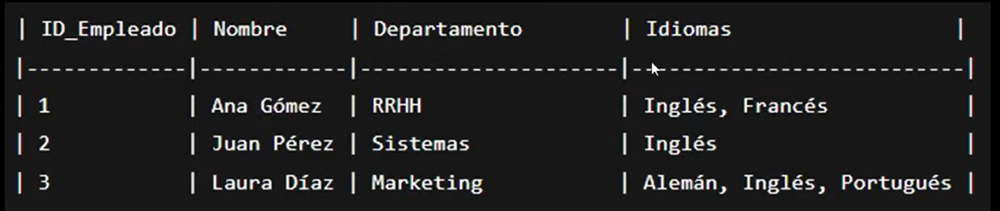
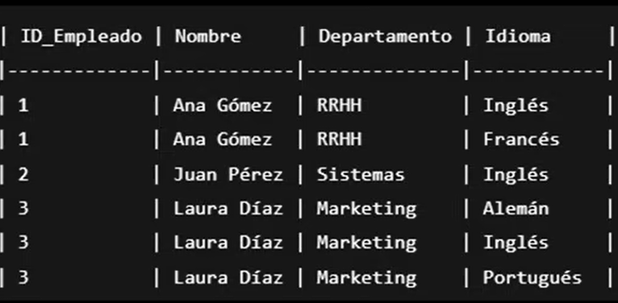
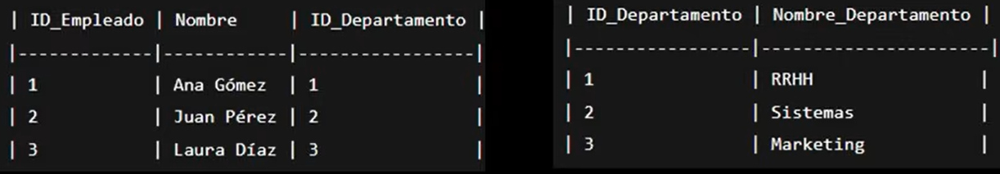

# Normalización de Bases de Datos

## Definición

La normalización es un proceso que se aplica a las bases de datos relacionales con el fin de:

- **Eliminar la redundancia de datos**
- **Evitar anomalías** de inserción, actualización y eliminación
- **Garantizar la integridad** de los datos

---

## ¿Por qué normalizar? — Las Anomalías

Antes de ver las formas normales, es importante entender el *problema* que resuelven. Una tabla mal diseñada produce tres tipos de anomalías:

- **Anomalía de inserción:** No puedes registrar un departamento nuevo si no tiene empleados asignados aún.
- **Anomalía de actualización:** Si un departamento cambia de nombre, debes modificarlo en *todas* las filas donde aparece. Si se te olvida una, los datos quedan contradictorios.
- **Anomalía de eliminación:** Si eliminas al único empleado de un departamento, pierdes también toda la información de ese departamento.

---

## 0FN — Forma No Normalizada

Esta es la forma *no normalizada* de una base de datos. En este estado, una sola celda puede contener múltiples valores (listas), lo que impide un tratamiento consistente de los datos.



> **Problema:** Varios datos conviven en una sola columna, lo que imposibilita filtrar, ordenar o relacionar correctamente la información.

---

## 1FN — Primera Forma Normal

**Regla:** Todos los atributos deben ser **atómicos**, es decir, cada celda debe contener un único valor por fila. Se eliminan las listas y los grupos repetitivos.



> **Resultado:** Se eliminan las listas, pero ahora aparecen **redundancias** en nombres, IDs y departamentos. Esto nos lleva a la siguiente forma normal.

---

## Concepto clave: Dependencia Parcial

Antes de 2FN es importante entender este concepto. Una **dependencia parcial** ocurre cuando un atributo depende solo de *una parte* de una clave primaria compuesta. Con clave compuesta nos referimos a que la tabla tiene dos o más atributos que juntos forman la clave primaria, es decir, se necesitan ambos para identificar de forma única cada fila.

**Ejemplo:**
```sql
-- Clave primaria compuesta: (empleado_id, departamento_id, id_proyecto)
EMPLEADO(empleado_id, departamento_id, id_proyecto,
         nombre_empleado, nombre_departamento, nombre_proyecto)

-- nombre_empleado      → depende SOLO de empleado_id      ❌ parcial
-- nombre_departamento  → depende SOLO de departamento_id  ❌ parcial
-- nombre_proyecto      → depende SOLO de id_proyecto      ❌ parcial
```

Cada uno de esos atributos debería vivir en su propia tabla.

> **Nota:** Las dependencias parciales surgen naturalmente en relaciones **N:M** 
> (muchos a muchos), que son las que generan claves compuestas. En relaciones 
> **1:N** no hay clave compuesta y por ende no hay dependencias parciales.

---

## 2FN — Segunda Forma Normal

**Regla:** Cumplir 1FN y **eliminar todas las dependencias parciales**. Todo atributo no clave debe depender de la clave primaria *completa*.

Para lograrlo, se separan los componentes de la clave primaria compuesta y cada uno se convierte en la clave primaria de su propia tabla. Las relaciones entre tablas se mantienen mediante **claves foráneas**.

**Ejemplo:**
```sql
-- ✅ Después de aplicar 2FN

-- Relaciones 1:N → FK directa, sin tabla intermedia
EMPLEADO    (empleado_id PK,     nombre_empleado, departamento_id FK)
DEPARTAMENTO(departamento_id PK, nombre_departamento)

-- Relación N:M → tabla intermedia
PROYECTO    (id_proyecto PK,     nombre_proyecto)
ASIGNACION  (empleado_id FK,     id_proyecto FK)
```


> **Resultado:** Se eliminan las dependencias parciales, pero puede surgir un nuevo problema: la **dependencia transitiva**.

---

## Concepto clave: Dependencia Transitiva

Es similar al razonamiento matemático: si **A → B** y **B → C**, entonces **A → C** de forma indirecta.

En bases de datos: si el `id_empleado` determina a qué `departamento` pertenece el empleado, y ese `departamento` tiene atributos propios como `nombre_departamento`, entonces `nombre_departamento` está siendo determinado *indirectamente* por `id_empleado`.

**El problema concreto:** si se elimina ese empleado, parecerá que el departamento también desaparece, aunque otros empleados pertenezcan a él.

---

## 3FN — Tercera Forma Normal

**Regla:** Cumplir 2FN y **eliminar todas las dependencias transitivas**. Todo atributo no clave debe depender *únicamente* de la clave primaria, no de otros atributos no clave.

Esto se resuelve extrayendo el atributo transitivo a su propia tabla y vinculándolo mediante una clave foránea.



> **Resultado:** Si se elimina un empleado, solo se elimina la referencia (la clave foránea) al departamento, no el departamento en sí.

---

## BCNF — Forma Normal de Boyce-Codd

Es una versión más estricta de 3FN. La regla es que **todo determinante debe ser una superclave**.

En la práctica, si una tabla llega a 3FN, el 95% de los casos queda correctamente normalizado. BCNF aplica en situaciones especiales donde existen múltiples claves candidatas que se solapan.

---

## ⚖️ Compromiso entre Normalización y Rendimiento

Normalizar demasiado puede perjudicar el rendimiento en ciertos contextos:

| Escenario | Recomendación |
|---|---|
| Sistemas transaccionales (muchos INSERT/UPDATE) | Normalizar hasta 3FN o BCNF |
| Sistemas de reportes o analítica | Considerar desnormalización controlada |
| Consultas frecuentes con muchos JOINs | Evaluar columnas redundantes de forma intencional |

> La **desnormalización controlada** no es un error de diseño, es una decisión arquitectónica consciente.